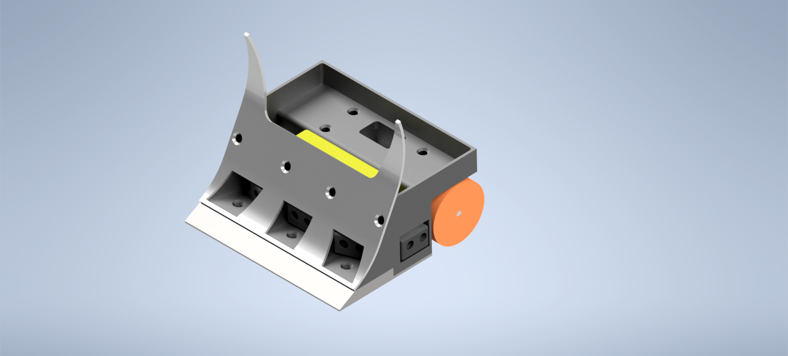

# Meraxes   

 * [Introduction](#introduction)
 * [Concept](#concept)
 * [Components](#components)

## Introduction
Meraxe's project is an mini sumo robot, weight class up to 500 grams. It's an automous robot, with primary objective to push the oponent robot outside de Dohyo area. It was developed with main focus of beating the top mini sumo teams in Brasil and conquering the spot to compete in international competitions, such as Romenia Pro Mini Sumo Competition.

## Concept
Meraxe's is an fast an agressive style mini sumo, inspired in the mexican mini sumo Iktan and in the brasilian mini sumo Corvo. The main focus of the project was having an stable robot, with an nice CG positioning and full front control. In this case we have 180º sensor control.

## Components
In this project we used:
- 5 JS40F sensors or similars
- 2 SLT20 whells
- 2 Silverback 6V 520RPM motors
- 1 Tattu Battery 3s 650mAh
- 1 Japanese Blade

